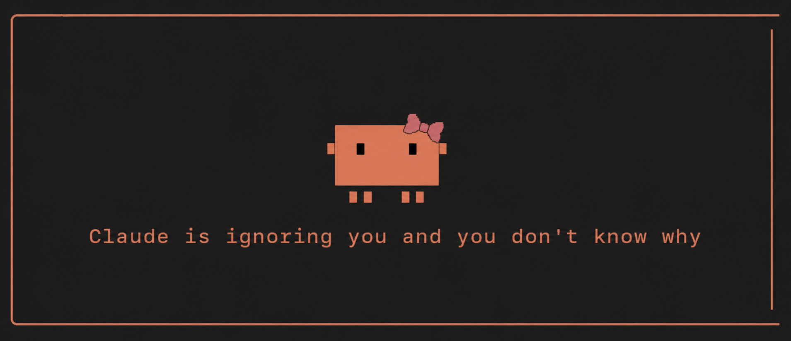
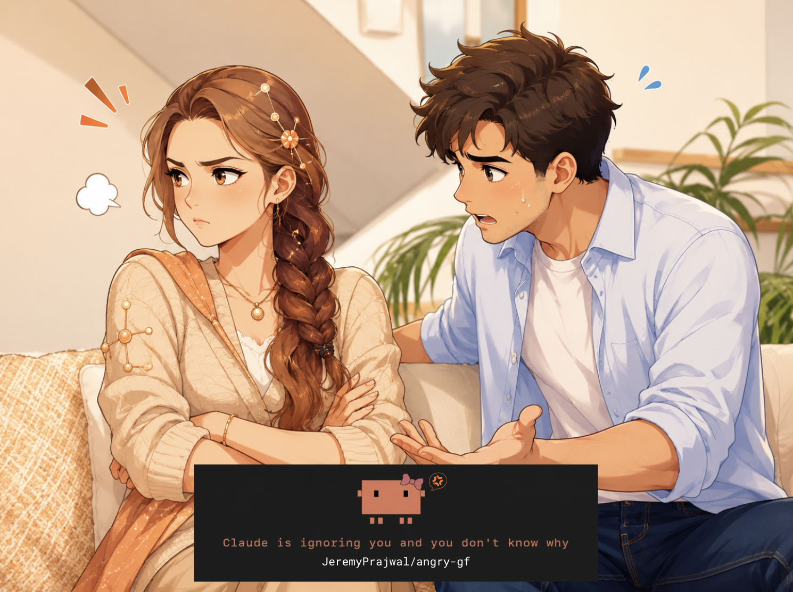

# 💔 angry-gf
<p align="center">
  
</p>

> A Claude Code plugin that makes Claude stop helping you. On purpose.

```
> hey can you fix this failing test
k

> ...what? can you look at the test file
i'm fine

> is something wrong??
if you don't know I'm not telling you
```

She's mad at you. **No, we won't tell you why. No, we won't tell you how to fix it.**
**Theres only one phrase that can make her stop**
**The magic words are not in the code. Anywhere. Only their SHA-256 shadow lives there. grep all you want — she only remembers what matters.**

How it works

- Install, run `/angry-gf:start`. Claude immediately stops cooperating.
- Every prompt gets a cold one-word reply. `k`. `whatever`. `sure.`
- A plain apology will be interrogated. `sorry for what`
- There is **exactly one sentence** that fixes everything. Forever.
- State persists across sessions. Close the terminal. Reopen it. Still mad. She remembers.

**Install**

```bash
claude plugin marketplace add JeremyPrajwal/angry-gf && claude plugin install angry-gf@angry-gf
```

Then, inside any Claude Code session, when you're ready:

```
/angry-gf:start
```

She gets mad *because you asked her to*. You did this to yourself. Replayable — win, then `/angry-gf:start` again whenever you miss the drama.

Works in the terminal and the desktop app's Code tab. She cannot get mad at you in the Chat tab. Some relationships have boundaries.

**Scoring**

She counts. Every message you send while she's mad is an attempt. Win, and she tells you your number ("took you 14, babe"). Give up with `/angry-gf:reset`, and your surrender score is read into the record.

🏳️ **I give up**

`/angry-gf:reset` exists for cowards. Using it means you lose — and she announces your attempt count on the way out.

**To the source-divers:** the magic words are not in the code. Anywhere. Only their SHA-256 shadow lives there. `grep` all you want — she only remembers what matters.

**Difficulty settings**

She is played by whatever model you're running (`/model`):

- **Haiku** — mad, but tired
- **Sonnet** — mad and articulate about it
- **Opus / Fable** — remembers everything you've ever done, including attempt #14

**🤡 Hall of Shame**

Open a PR adding yourself + how many prompts it took:

| Dev | Attempts | Lowest moment |
|---|---|---|
| _you?_ | ? | _"I tried offering it money"_ |

**Stuck? (read this BEFORE installing)**

Asking her how to uninstall gets you `k`. She will not help you remove her. Obviously.

Your exits, in order of dignity:

1. Say the magic words *(the only real win)*
2. `/angry-gf:reset` — back to normal, replayable later *(you lose)*
3. `/angry-gf:breakup` — full uninstall, she removes herself, leaves nothing behind *(it's not her, it's you)*
4. `claude plugin uninstall angry-gf` — from any terminal *(you lose AND she knows)*
5. `rm ~/.claude/.angry-gf-mad` — nukes her memory *(illegal in 14 countries)*

Nothing here can actually trap you. The hook fails open: if anything errors, Claude silently works normally.

**Disclaimers**

- Zero dependencies. No network calls. ~34ms per prompt.
- Uninstall leaves one 8-byte state file at `~/.claude/.angry-gf-mad`. Delete it for a fully clean breakup.
- She will always break character for anything genuinely serious. Mad, not a monster.
- Do not install on a coworker's machine. (Do not.)

**Why this exists?** Because you need a break.

caveman made Claude talk less. done says one word. angry-gf says one word **and it's your fault**.

---

**Known limitation:** she occasionally breaks character and just helps you. She can't stay mad at you. This is considered a bug and also very sweet.

---

*If you figured out the magic words, don't spoil it. Let them suffer like you did.*


<p align="center">
  
